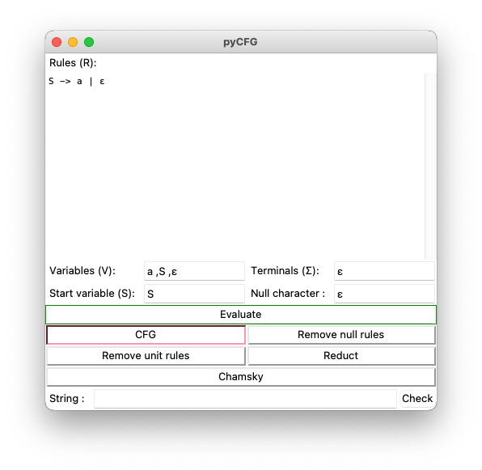

pyCFG is an application and library for working with context free grammars (CFG) in [Python](https://www.python.org/).
It uses [tkinter](https://wiki.python.org/moin/TkInter) for it's graphical interface.

<p align="center">
  
</p>

## Installing application

### Prerequisites
- [Python3.5+](https://www.python.org/)
- [tkinter](https://wiki.python.org/moin/TkInter)

### Running

```bash
$ python pycfg.py
```

### Windows

You can download pyCFG's binary for windows from [Here](https://github.com/mahdavipanah/pyCFG/releases).

## Using library
pyCFG library is in `cfg.py` module and can be imported and be used easily. For example:
```Python
from cfg import CFG

g = CFG({'S'}, {'a', 'b', 'c', 'λ'}, {('S', 'aSa'),
                                      ('S', 'bSb'),
                                      ('S', 'cSc'),
                                      ('S', 'λ')}, 'S', 'λ')

string = input("Enter a string: ")

if g.cyk(string):
    print("Grammar can generate the string!")
else:
    print("Grammar cannot generate the string!")
```
Above program gets a string from input and tells if the defined grammer can generate the string or not.

## Tests

If you want to test, make sure that `pytest` is installed, then run:

~~~bash
pytest test.py
~~~

## Author

Hamidreza Mahdavipanah

## License

[MIT](./LICENSE)
